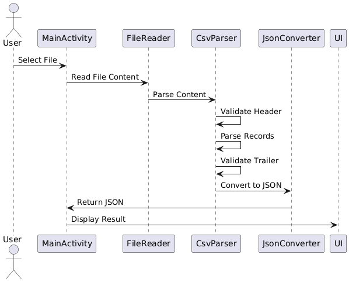
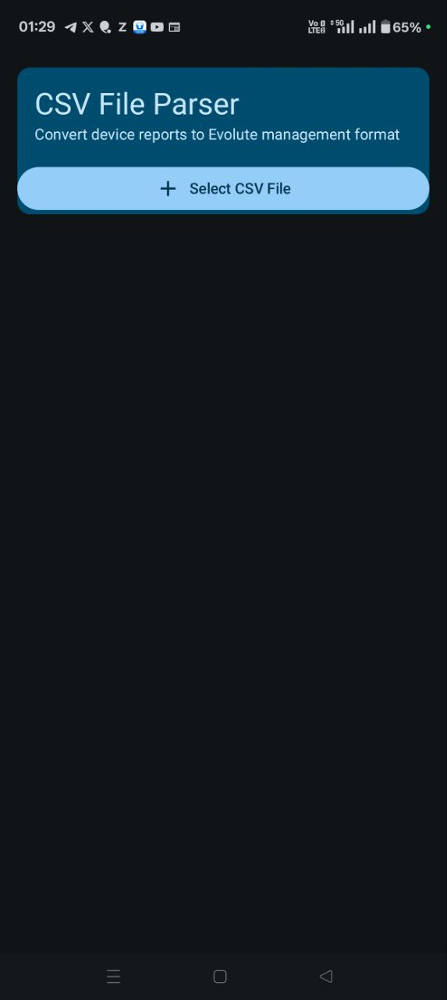
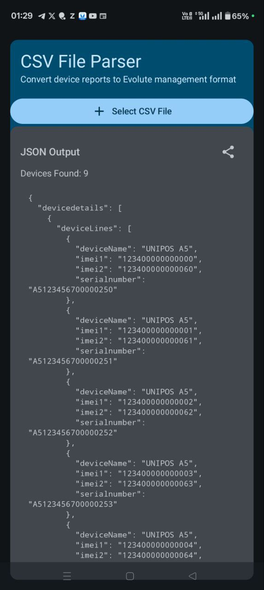

# CSV File Parser Android App
A production-ready Android application built with Jetpack Compose that parses device report CSV files and converts them to Evolute management JSON format.
## 📱 Overview
This application processes CSV-like device reports with a specific structure and transforms them into a standardized JSON format for device management systems.
The app provides a clean, Material Design 3 interface with robust error handling and validation.

## 🏗️ Architecture
The application follows MVVM (Model-View-ViewModel) architecture pattern with the following components:

- **UI Layer**: Jetpack Compose screens with Material Design 3
- **ViewModel**: Manages UI state and business logic
- **Data Layer**: CSV parsing and JSON conversion utilities.
- **Models**: Data classes for CSV structure and output format

## Sequence Diagram

## 📋 **Features**

- ✅ File picker integration for CSV selection
- ✅ Real-time parsing with loading indicators
- ✅ Comprehensive error handling and validation
- ✅ JSON output with device count display
- ✅ Copy-to-clipboard functionality
- ✅ Scrollable JSON preview
- ✅ Material Design 3 UI
- ✅ Production-ready error handling


## 🛠️ Technical Stack

- Language: Kotlin
- UI Framework: Jetpack Compose
- Architecture: MVVM with StateFlow
- JSON Processing: Gson
- Material Design: Material Design 3
- Build System: Gradle with Kotlin DSL

## 📱 Screenshots
| OPEN CSV FILE         |  PROCESS AND DISPLAY JSON  |
|-----------------------|-------------------------------------|
|  |  |


## APK Download

You can download the APK file of the app from the link below:

[Download APK](https://drive.google.com/file/d/1vbGJ3kp4uSPiirmkttz56_IhXA5KwRjC/view?usp=drive_link)

## Getting Started

To run this project locally:

1. Clone the repository:
   ```bash
   git clone https://github.com/vivekprcs/CSVParser.git
